# **Beer_Advocate**

**This repository is an evolution of a practical assignment for the Data Mining course in the Data Science Master’s program at the Open University of Catalonia (UOC)**

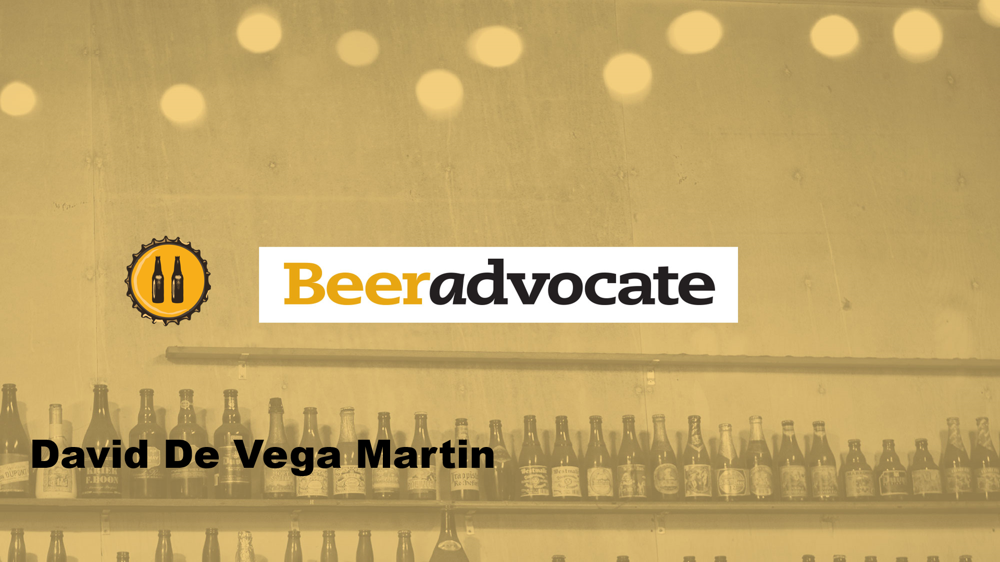
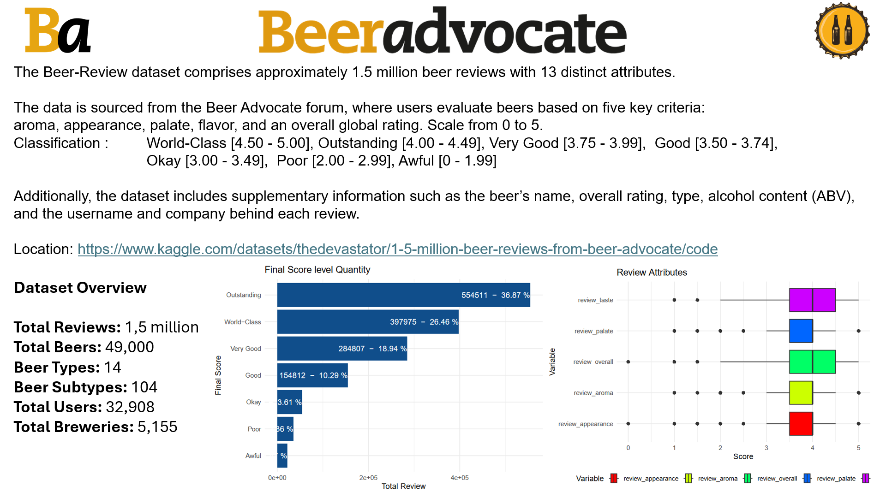
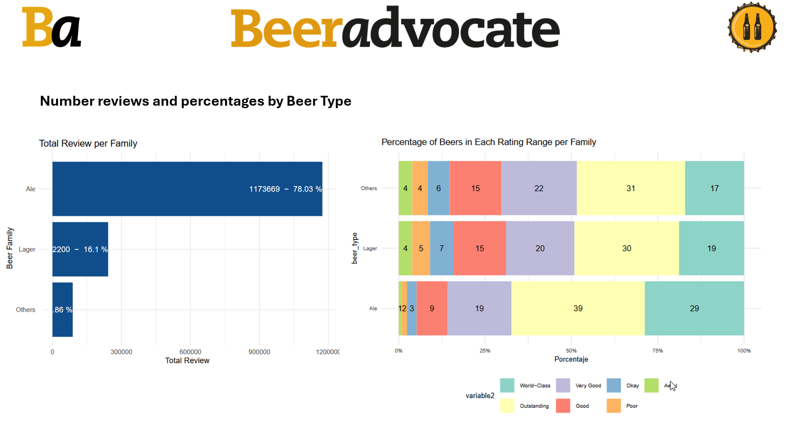
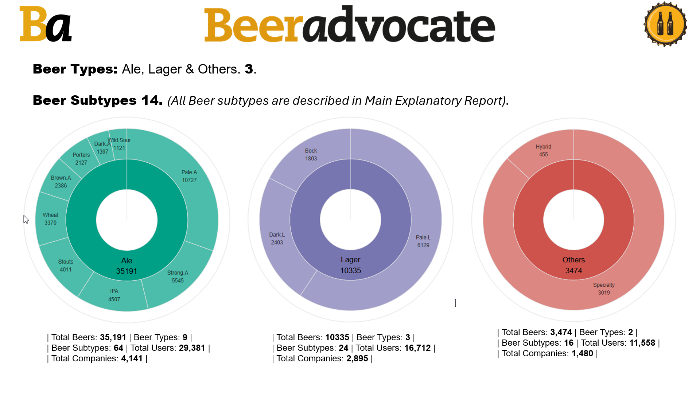
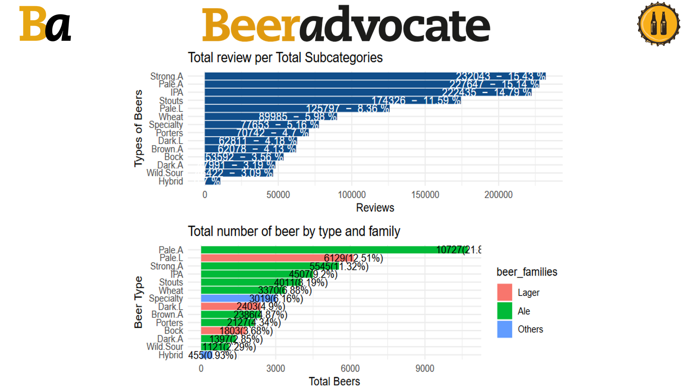
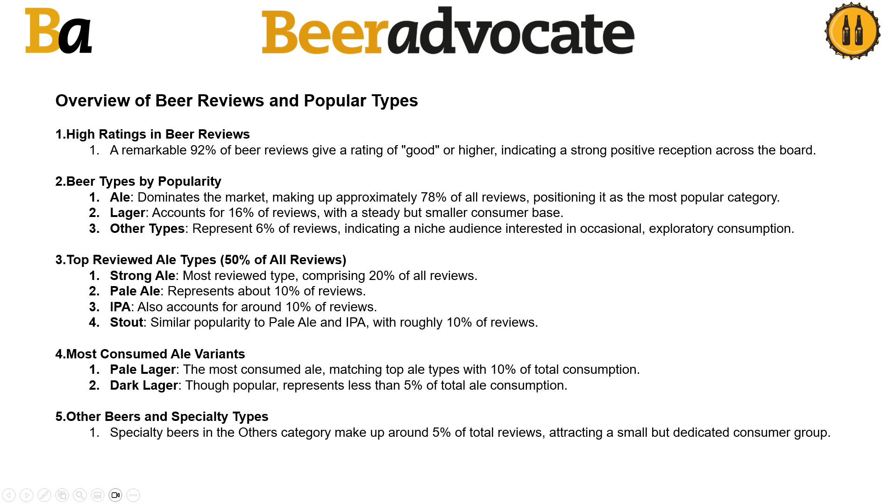
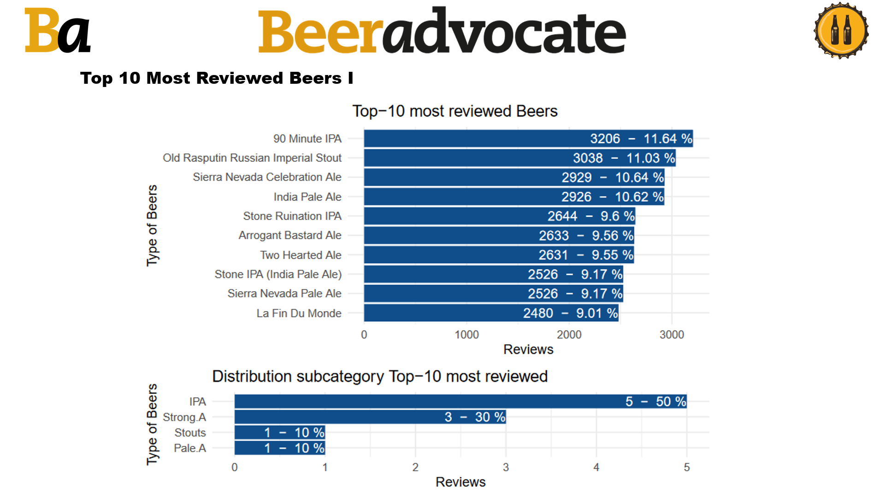
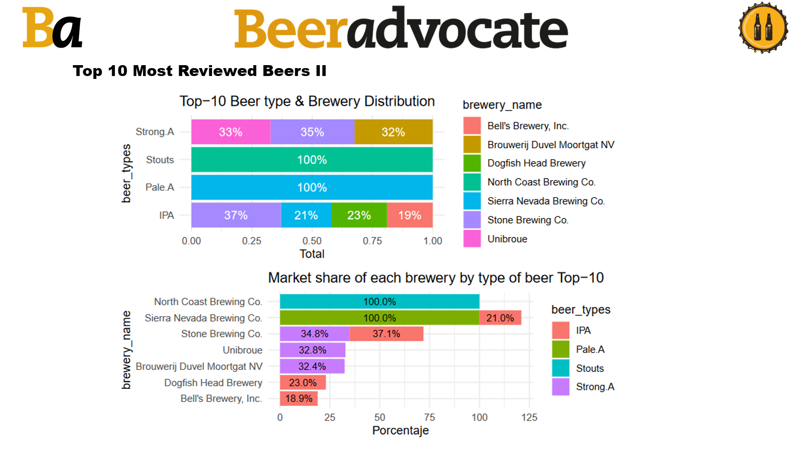
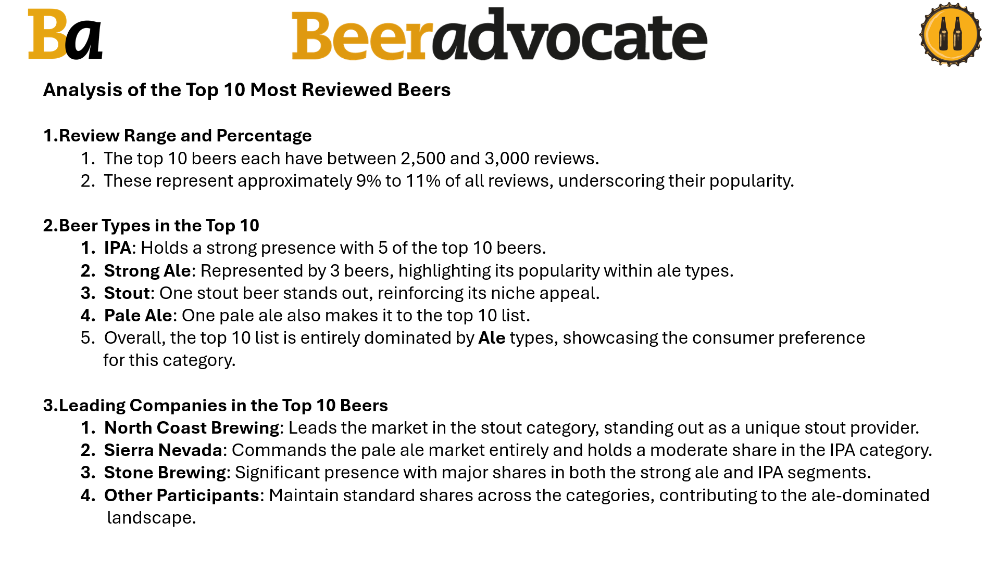
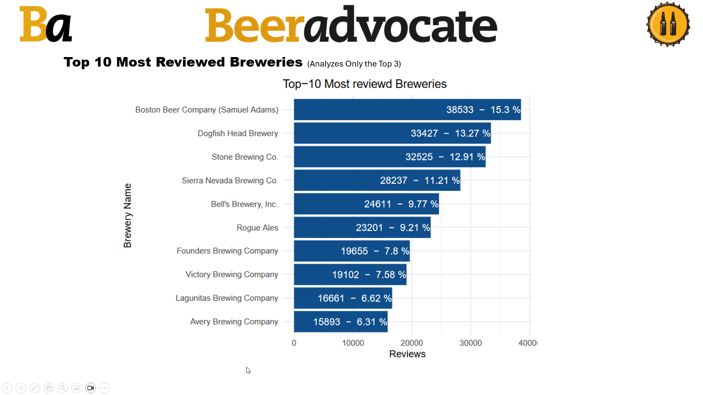
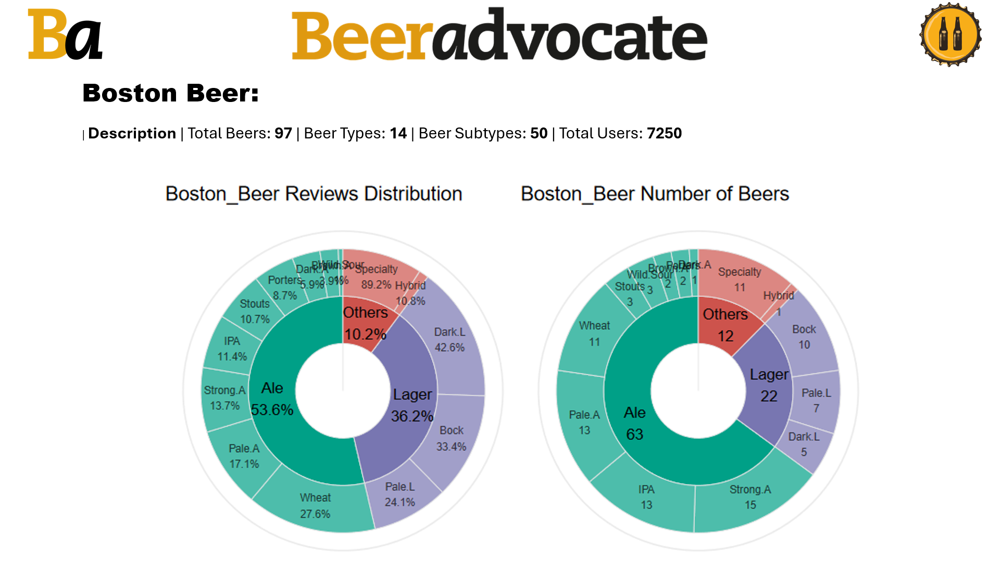
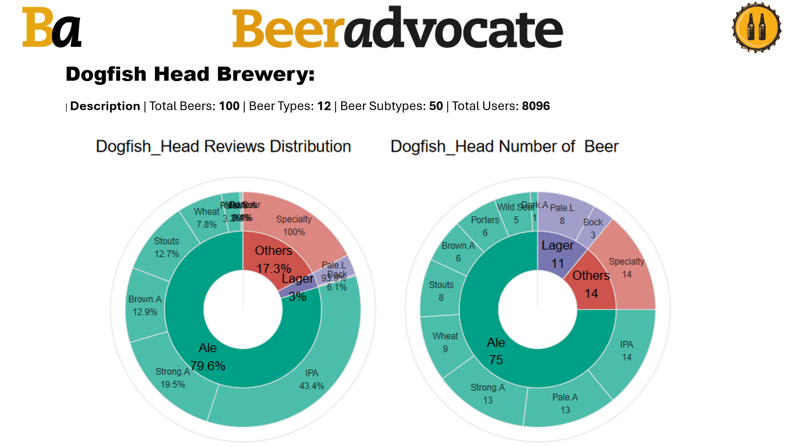
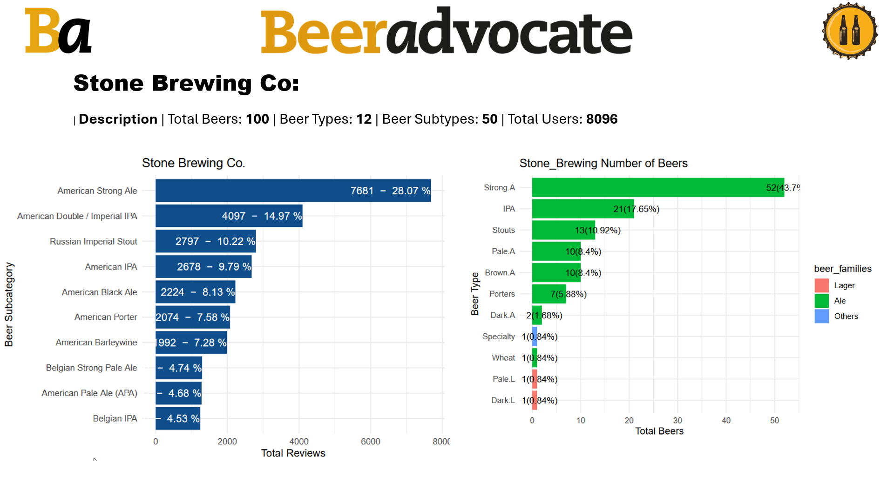
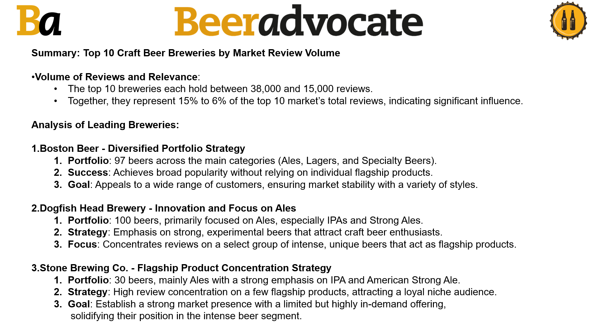
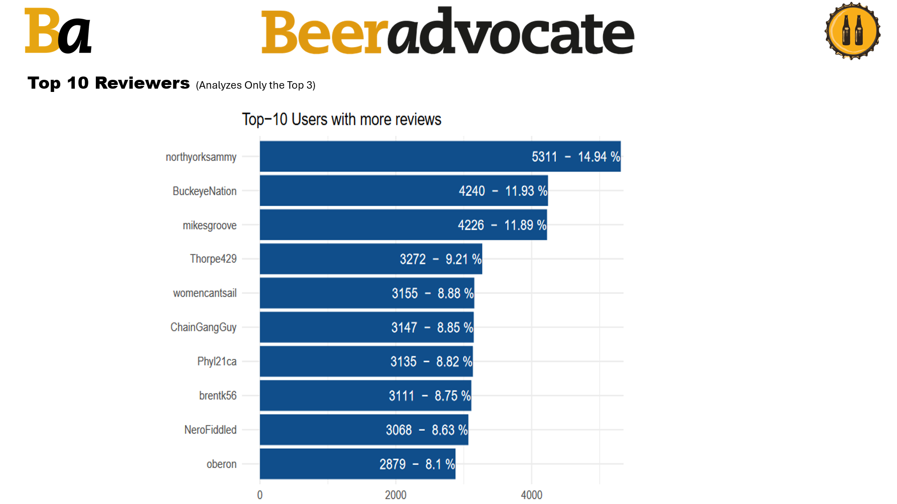
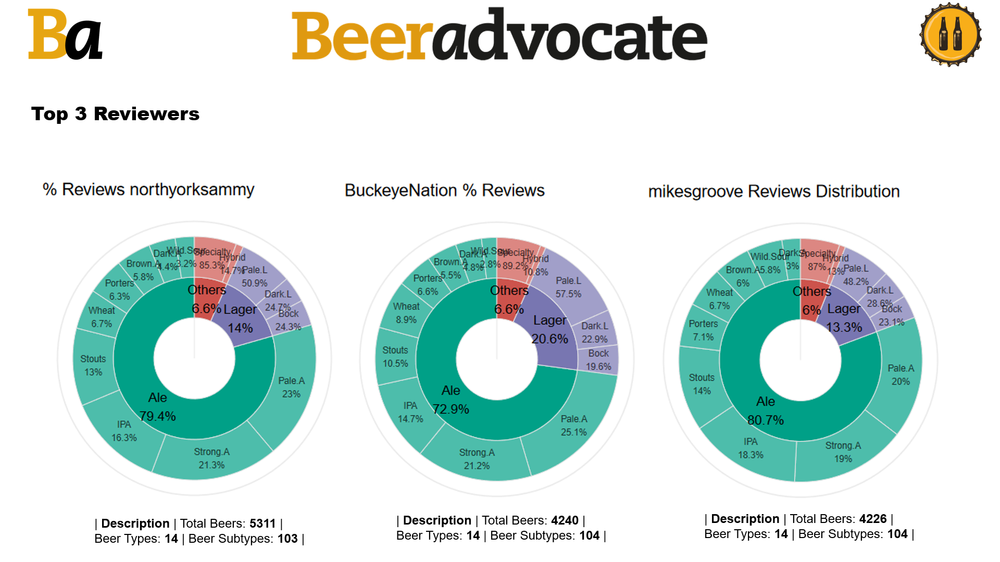
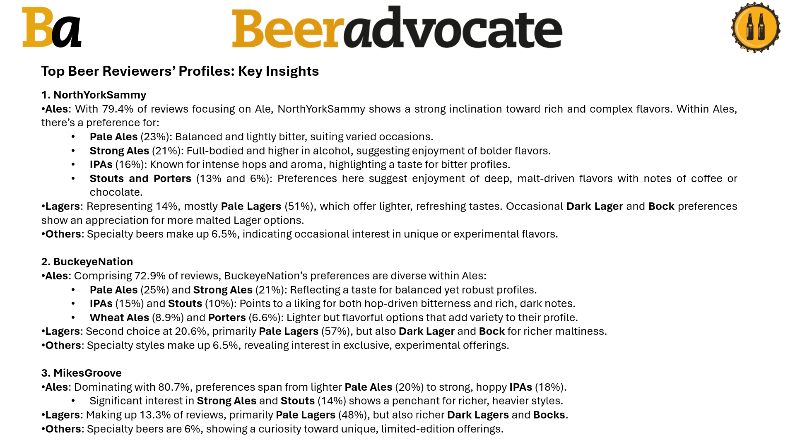
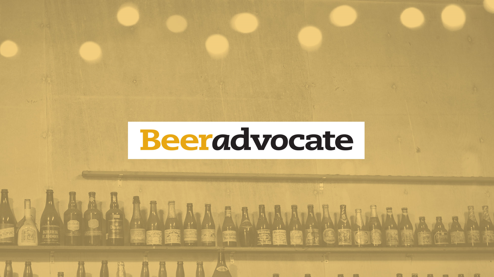

### Project includes:
* beer_reviews.zip  Contains original dataset.
* Beer_Advocate.rmd Contains R script
* Beer_Advocate.pdf Contains Main Explanatory Report.
* BeerAdvocate_V1.pptx Contains Powerpoint resume.
